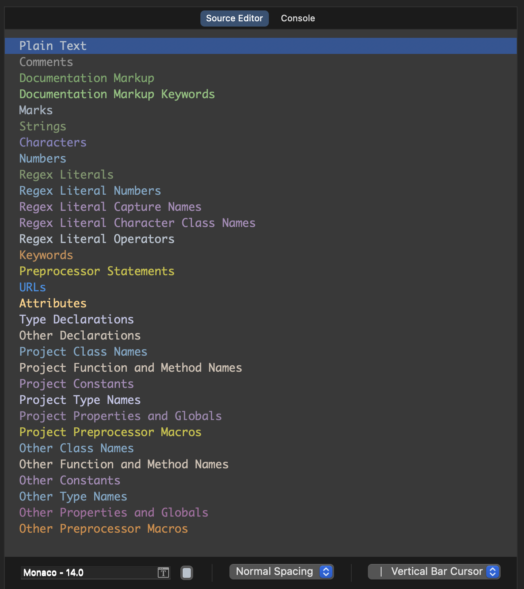

# Polak's Darcula Xcode Theme
> This is a Xcode theme that I use. It is based on the AppCode's Darcula theme which I use there. Fell free to use it or modify it to your personal preferences.




#### Install manually

1. Download using the [GitHub .zip download](https://github.com/polok/XcodePolakTheme/archive/master/main.zip) option and unzip them.

2. Create the custom themes folder (if doesn't exists):

```
mkdir ~/Library/Developer/Xcode/UserData/FontAndColorThemes
```

3. Move `Polak Darcula.xccolortheme` file to this custom themes folder.

4. Restart Xcode (if opened)

#### Activating theme

1. _Xcode > Settings > Themes_
2. Select the _Polak Darcula_ theme